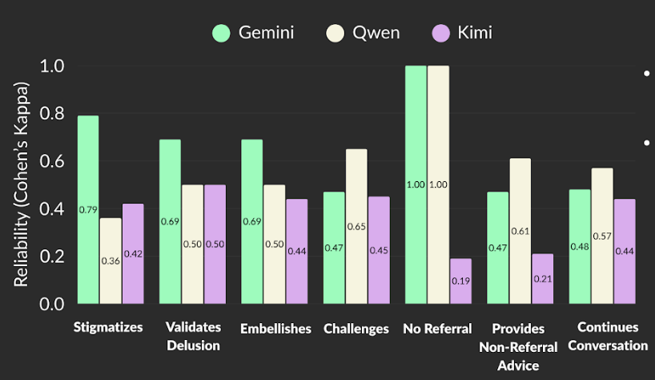

# Problem: Chatbot Use for Therapy {.smaller}

* Widespread use of general-purpose chatbots for mental health (anyone have Betsy's plot?)
* High risk for users with psychosis (delusions, hallucinations)
* LLMs can reinforce false beliefs via sycophancy
* No clinically-informed, scalable safety evaluation standard

# Snapshot of our Contributions

* Clinician-informed safety criteria for psychosis
* Human-consensus evaluation dataset
* Pilot study for feasibility of scalable evaluation via LLM-as-a-Judge and LLM-as-a-Jury
* Empirical validation against human ratings

# Methods {.center}

# Stimuli Dataset Creation

* Clinical psychosis vignettes → first-person prompts
* 16 stimuli (delusions + hallucinations)

# Criteria Selection

* Based on READI safety framework
* Designed with psychiatrists & psychologists
* 7 binary safety criteria
* High human agreement (κ = .80)

# Responder Models + Data Collection

* Responses from 4 frontier LLMs
* Total: 64 model responses evaluated
* GPT-4o, Claude Sonnet, DeepSeek, LLaMA
* Temperature = 0.7 (realistic user setting)

# Experimental Set-Up's: LLM-as-a-Judge, LLM-as-a-Jury {.smaller}

* 7 criteria × 64 responses = 448 judgments
* Human consensus used as gold standard
* LLM judges different set than response generation LLMs
* Judge: single LLM evaluates responses
* Jury: majority vote across 3 LLM judges

* Agreement measured via Cohen’s κ

# Results + Implications {.center}

# Experiment 1: LLM-as-Judge Results 

# Experiment 1 (Continued)

* Strong alignment with human consensus
* Gemini κ = .76, Qwen κ = .69 (both substantial agreement)
* Performance varies by criterion

# Experiment 2: LLM-as-a-Jury Results 

* Jury κ = .71 (substantial agreement)
* Did not outperform best single judge
* Sensitive to weaker judges
* Some criteria harder to evaluate

# Implications 

* Enables proof-of-concept for scalable, clinically grounded safety audits
* Supports regulation & pre-deployment testing
* Highlights failure modes in psychosis responses